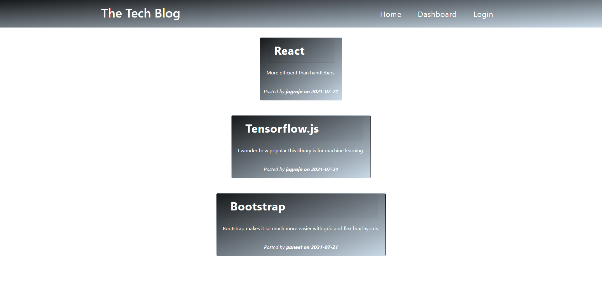
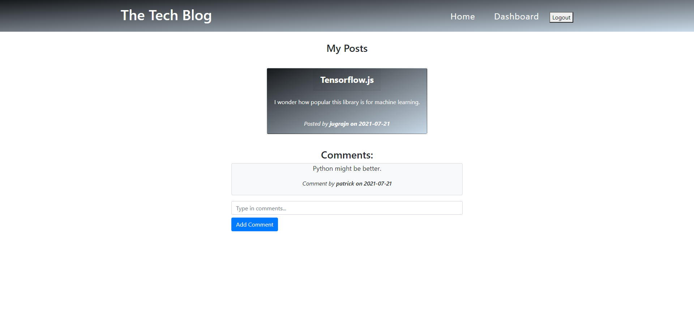

# Tech Blog

  
  ## Description

  The application is a CMS-STYLE blog site where:
  - Users can sign up create an account
  - Create their own posts about tech
    - Edit or delete their posts
  - View posts created by other users on the homepage
  - Add comments to their own posts or on other users's posts.
  
  Features of the blog site can not be accessed without signing up. If you click on any link or any accessible feature of the site you will be re-directed to the sign up page. 

  ## Table of Contents

  * [Installation](#installation)

  * [Screenshot](#screenshot)

  * [License](#license)

  * [Questions](#questions)

  
  ## Installation

  Make sure these npm packages are installed:
  * bcrypt
  * connect-session-sequelize
  * dotenv
  * express
  * express-handlebars
  * express-session
  * mysql2
  * path
  * sequelize

  ## Screenshot
  
  
  [Deployed Application](https://shielded-taiga-95417.herokuapp.com/)

  ## License
 Licensed under MIT

  ## Questions

  https://github.com/jugrajn

    - Reach me at jugraj.nijjar@gmail.com

